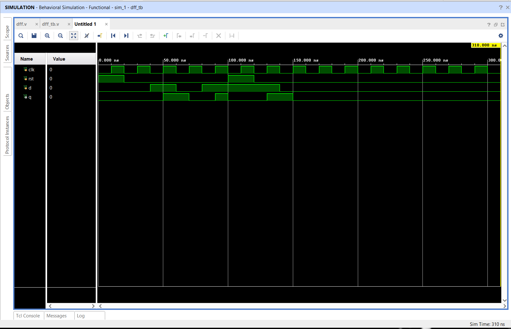
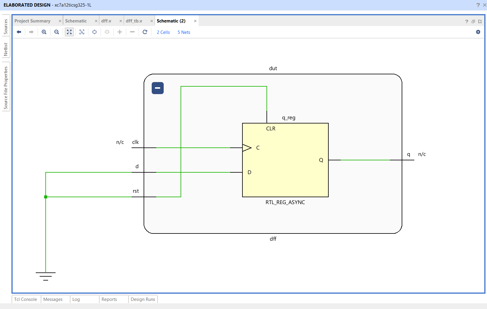

# 🔥 Positive Edge Triggered D Flip-Flop using Verilog HDL

## 📌 Project Overview

This project implements a **Positive Edge Triggered D Flip-Flop (DFF)** with an **Asynchronous Active-High Reset** using **Verilog HDL**. The design captures the input data (`D`) on the rising edge of the clock and stores it until the next active clock edge.

The D Flip-Flop is one of the fundamental sequential building blocks used in digital systems, serving as the basis for registers, counters, finite state machines (FSMs), shift registers, and processor pipelines.

The design was developed, simulated, and verified using **Xilinx Vivado 2025.2**.

---

# 🚀 Features

- Positive Edge Triggered Operation
- Asynchronous Active-High Reset
- Single-Bit Data Storage
- Fully Synthesizable RTL Design
- Behavioral Simulation using Verilog Testbench
- RTL Schematic Generation
- FPGA Ready Design

---

# 🛠️ Tools Used

- Verilog HDL
- Xilinx Vivado 2025.2
- XSim Simulator
- RTL Analysis
- Behavioral Simulation

---

# 📂 Project Structure

```
D-FlipFlop-Verilog/
│
├── dff.v
├── dff_tb.v
├── waveform.png
├── rtl_schematic.png
└── README.md
```

---

# ⚙️ Functional Description

A D Flip-Flop stores one bit of information. On every **positive edge of the clock**, the input **D** is transferred to the output **Q**.

If the reset signal is asserted, the output is immediately cleared regardless of the clock.

### Truth Table

| Reset | Clock Edge | D | Q (Next State) |
|:----:|:----------:|:-:|:--------------:|
| 1 | X | X | 0 |
| 0 | ↑ | 0 | 0 |
| 0 | ↑ | 1 | 1 |
| 0 | No Edge | X | No Change |

---

# 🧪 Functional Verification

The design was verified using a custom Verilog testbench covering the following scenarios:

- Asynchronous Reset
- Data Storage Logic '0'
- Data Storage Logic '1'
- Multiple Clock Cycles
- Reset Recovery
- Positive Edge Triggering

The simulation confirms that the output updates only on the rising edge of the clock while responding immediately to the asynchronous reset.

---

# 📸 Simulation Results

## Simulation Waveform



---

## RTL Schematic



---

# 🔄 Working Principle

```
          +----------------------+
 D ------>|                      |
          |      D Flip-Flop     |------> Q
CLK ----->| (Positive Edge)      |
          |                      |
RST ----->| Asynchronous Reset   |
          +----------------------+
```

---

# 🎯 Applications

- Shift Registers
- Counters
- Register Files
- Memory Elements
- Finite State Machines (FSMs)
- Processor Pipelines
- Data Synchronizers
- FPGA-Based Digital Systems

---

# 📚 Learning Outcomes

This project provided hands-on experience in:

- Verilog HDL Programming
- Sequential Logic Design
- Positive Edge Triggered Circuits
- Asynchronous Reset Implementation
- RTL Coding
- Testbench Development
- Functional Verification
- RTL Analysis
- Vivado Design Flow

---

# 🚀 Future Enhancements

- D Flip-Flop with Enable Signal
- Synchronous Reset D Flip-Flop
- Parameterized Register Width
- Scan D Flip-Flop for DFT
- Master-Slave D Flip-Flop
- SystemVerilog Self-Checking Testbench

---

# 👨‍💻 Author

**T S Sai Likhith**

Bachelor of Engineering (B.E.)  
Electronics and Communication Engineering (ECE)

### Areas of Interest

- VLSI Design
- RTL Design
- FPGA Design
- Digital IC Design
- Design Verification

---

## ⭐ Support

If you found this project useful, consider giving it a **Star ⭐** on GitHub.
